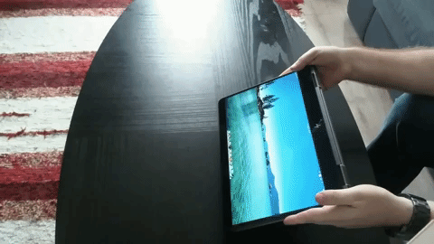

# AutoRotateScreen
A Python script to give auto-rotation capabilities to 2-in-1 laptops in Linux

<a href="https://www.youtube.com/watch?v=lVW6cMOrwZ0" target="_blank">Click on gif to see full video</a>

This script uses **iio-sensor-proxy** to read the screen's pitch and roll angles and sets the desired orientation using **xrandr**. Please install these programs if they aren't already included to make this work.

To make the script permanent, make it executable with **chmod +x AutoRotateScreen.py** and add it to the Startup Applications list so it starts working at login.